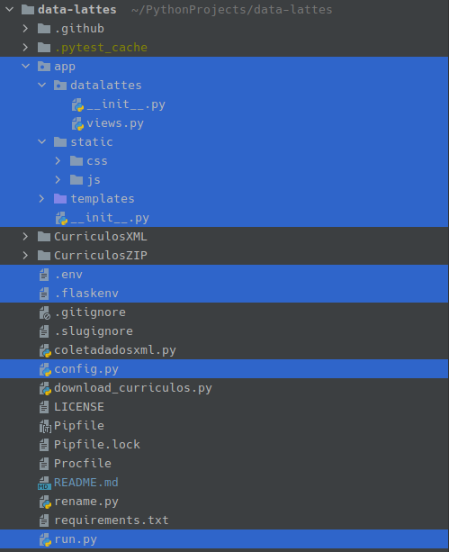

# data-lattes

[comment]: <> (<h4 style="text-align:center">Python and D3.js</h4>)
<p style="text-align:center">
    
    
    
</p>
Projeto da disciplina de Tópicos em Computação II do curso de Bacharelado em Sistemas de Informação da UFPA.

## Objetivos
* Coletar dados da plataforma Lattes
* Tratar e analisar os dados obtidos
* Mostrar os dados obtidos com gráficos em páginas web utilizando D3.js

## Equipe
* [Francielma Assunção](https://github.com/FrancielmaA)
* José Perdigão
* [Pedro Sousa](https://github.com/SousaPedro11)
* [Rafael Paixão](https://github.com/Rapaix)
* Raphael Campos
* Wellington Santos
* [Yuri Melo](https://github.com/yurimses)

## Tecnologias
* [Python 3](https://www.python.org/)
* [Pip](https://pip.pypa.io/en/stable/) ou [Pipenv](https://github.com/pypa/pipenv)
* [Flask](https://flask.palletsprojects.com/en/1.1.x/),
  [Flask-Migrate](https://flask-migrate.readthedocs.io/en/latest/),
  [Flask-Bootstrap](https://pythonhosted.org/Flask-Bootstrap/),
  [Flask-SQLAlchemy](https://flask-sqlalchemy.palletsprojects.com/en/2.x/)
* [Pytest](https://docs.pytest.org/en/stable/)
* [gunicorn](https://gunicorn.org/)
* [D3.js](https://d3js.org/)

## Ambiente de desenvolvimento
### Preparação
* Instalar o Python
* Clonar o projeto
    ```shell
    git clone https://github.com/SousaPedro11/data-lattes.git
    ```
* Mude para o diretório raiz do projeto
* Criar um ambiente virtual para isolar a instalação das dependências, utilizando pip ou pipenv
### Usando Pipenv
* Instalar o pipenv utilizando o pip

    No Linux seria: ```sudo pip install pipenv```
* Criar o abiente virtual
  * Verificar e se preciso alterar para 3.8 a versão do Python no arquivo [Pipfile](Pipfile)
  * Criar o ambiente com: ```pipenv --three```
* Instalar dependências
  * Entrar no shell do pipenv: ```pipenv shell```
  * Instalar dependencias com: ```pipenv install```

### Usando pip
* criar o abiente virtual
  ```shell
  python -m venv venv
  ```
* Ativar o ambiente virtual
  * No Linux
    ```shell
    source ./venv/bin/activate
    ```
  * No Windows
    ```
    source .\venv\Scripts\activate
    ```
* instalar dependências
  * instalar dependencias com: ```pip install -r requirements.txt```


## Como executar
### Padrão
Para acesso em [http://localhost:5000](http://localhost:5000)
```shell
flask run
```

### Gunicorn (standalone server - somente Linux)
Para acesso em [http://localhost:5000](http://localhost:5000)
```shell
gunicorn --workers=5 --bind=0.0.0.0:5000 --access-logfile - --error-logfile - 'run:app'
```
ou
Para acesso em [http://localhost:8000](http://localhost:8000)
```shell
gunicorn --workers=5 run:app
```

## Deploy (execução no Heroku)
O deploy é automatizado, atualmente, utilizando a branch flask_develop.

O link da produção: [https://data-lattes.herokuapp.com/](https://data-lattes.herokuapp.com/)

## Estrutura do projeto Flask


### Breve descrição
* [.env](.env) e [.flaskenv](.flaskenv): arquivos de configuração das variáveis de ambiente
* [config.py](config.py): arquivo com classes de configuração
* [run.py](run.py): arquivo principal do flask, equivalente ao main.py
* [app](app): diretório da aplicação flask.
* [app/\__init\__.py](app/__init__.py): arquivo que contém a factory da aplicação flask
* [app/datalattes](app/datalattes): diretório da Blueprint responsável pelo roteamento
* [app/datalattes/\__init\__.py](app/datalattes/__init__.py): arquivo de definição da Blueprint
* [app/datalattes/views.py](app/datalattes/views.py): contém a lógica do roteamento
* [app/static](app/static): diretório que contém os diretórios dos arquivos estáticos da aplicação
* [app/templates](app/templates): diretório que contém os .html das páginas
